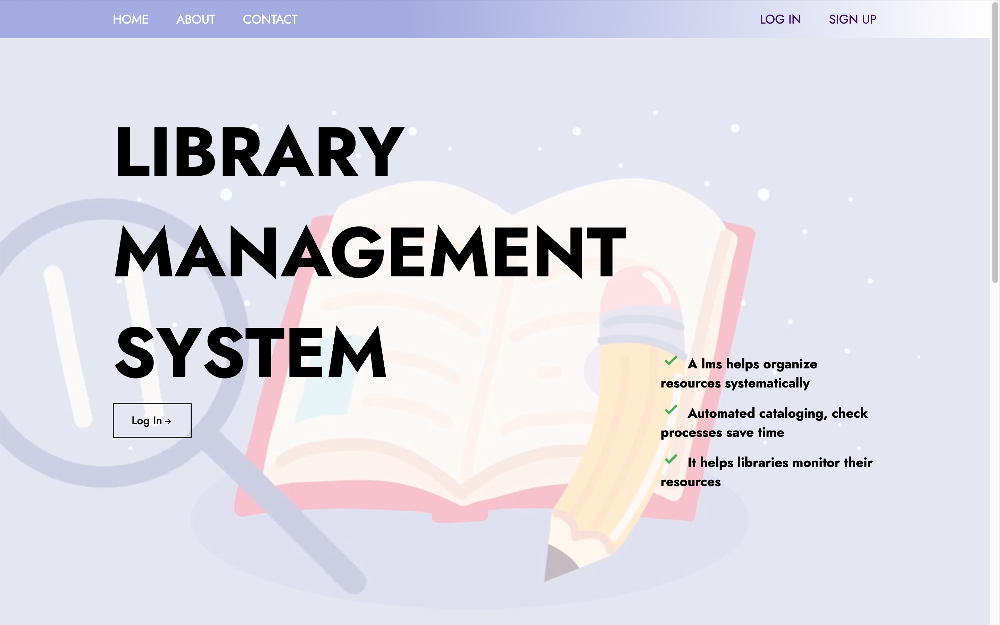
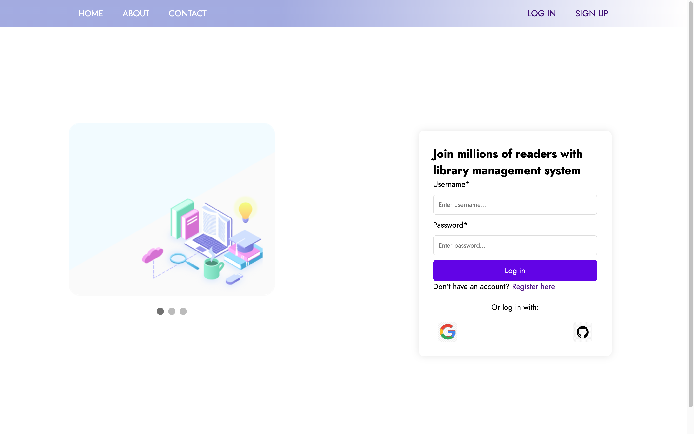
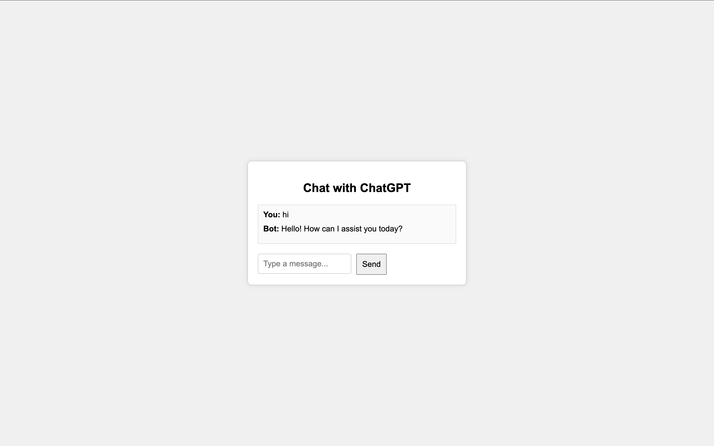
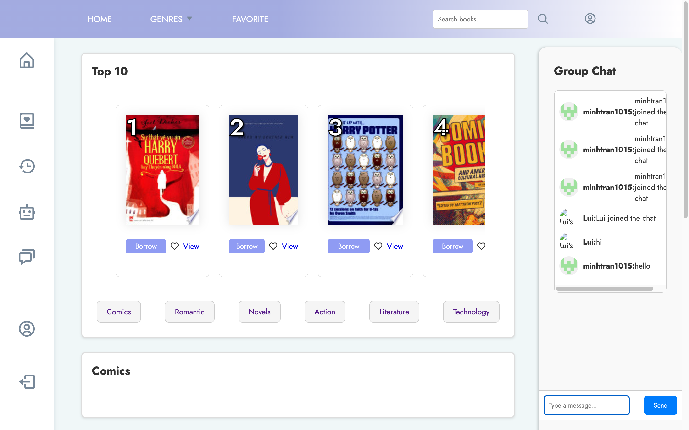
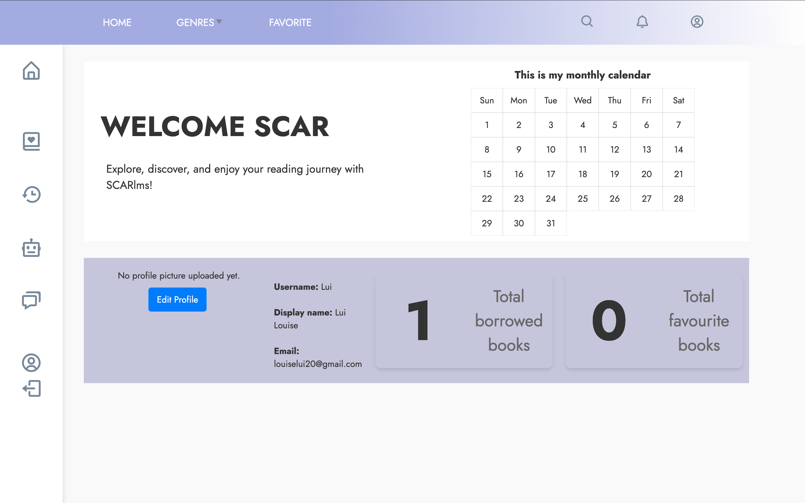
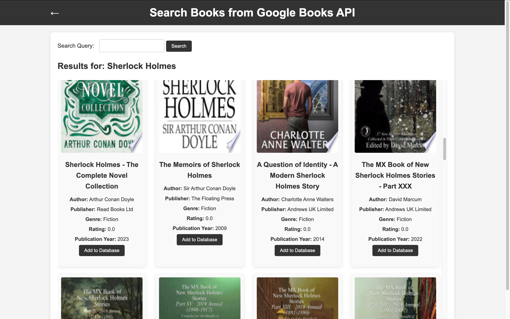
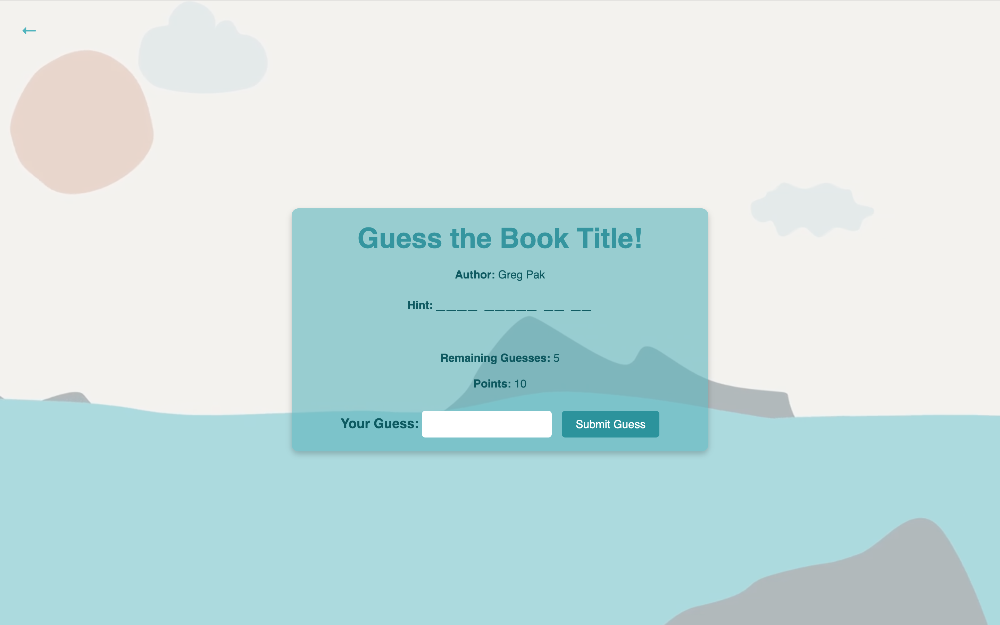

# Library Management System Project by SCAR

### Table of contents:

1. [Thành viên](#thành-viên)
2. [Giới thiệu](#giới-thiệu)
3. [Chi tiết tính năng](#chi-tiết-tính-năng)
4. [UML Diagram](#uml-diagram)
5. [Cách sử dụng](#cách-sử-dụng)
6. [Cài đặt](#cài-đặt)

# Thành viên:
* Lê Hoàng San
* Trần Đình Quang Minh
* Ngô Thị Tâm

# Giới thiệu:
* Ứng dụng quản lý thư viện giúp quản lý thông tin sách, người dùng, mượn trả sách, thống kê, báo cáo theo thời gian thực.
* Ứng dụng được viết chủ yếu bằng Java, sử dụng framework Spring Boot, Hibernate, MySQL, HTML, CSS, (JavaScript), Bootstrap.
* Ứng dụng được phát triển dựa trên mô hình MVC (Model-View-Controller).
* Ứng dụng có tích hợp game và multi-threading để tăng trải nghiệm người dùng.
* Ứng dụng có giao diện đẹp, dễ sử dụng.

(chèn ảnh giao diện ở đây)

# Chi tiết tính năng
### Quản lý sách:
  * Thêm sách mới
  * Xóa sách
  * Sửa thông tin sách
  * Tìm kiếm sách trong thư viện
  * Tìm kiếm sách với Google Books API
  * Xem danh sách sách
  * Thống kê dữ liệu sách
### Quản lý người dùng:
  * Thêm người dùng mới
  * Xóa người dùng
  * Sửa thông tin người dùng
  * Tìm kiếm người dùng
  * Xem danh sách người dùng
  * Thống kê dữ liệu người dùng
### Dành cho người dùng:
  * Mượn sách
  * Trả sách
  * Xem và sửa thông tin tài khoản
  * Đổi mật khẩu
  * Đăng nhập / Đăng xuất
  * Đăng ký tài khoản
  * Tìm kiếm sách
  * Tạo danh sách yêu thích
  * Xem sách đã mượn
### Các tính năng nổi bật khác:
  * **Game**: Game đoán tên sách theo gợi ý
  * **Google Books API**: Tìm kiếm sách với Google Books API
  * **Spring Security**: Bảo mật ứng dụng
  * **OAuth2 Authentication**: Đăng nhập với Google / Github
  * **Spring Websocket**: cho phép người dùng chat với nhau
  * **Spring Async**: tích hợp multi-threading giúp trải nghiệm mượt mà hơn
  * **Google Cloud Storage API**: Lưu trữ dữ liệu ảnh trên Google Cloud Storage và lưu đường dẫn vào database

# UML Diagram
(chèn ảnh UML)

# Demo








# Cài đặt
### Yêu cầu:
  * Java 8
  * Maven
  * MySQL
  * Git
  * IDE (IntelliJ IDEA, Eclipse, NetBeans, ...)
### Cài đặt:
  * Clone project từ Github:
    ```angular2html
        git clone https://github.com/HSandz/SCAR
    ```
    hoặc sử dụng `GitHub Desktop`
  * Mở project bằng IDE
  * Cấu hình MySQL:
    * Tạo database `lms`
    * Cấu hình username và password trong `application.properties`:
    ```angular2html
        spring.datasource.url=jdbc:mysql://localhost:3306/lms
        spring.datasource.username=root
        spring.datasource.password=your_password
    ```
  * Tìm đến file `LmsApplication.java` và chạy ứng dụng
  * Mở trình duyệt yêu thích và truy cập vào `http://localhost:8080`